# Rakt-हम (Blood Warriors)

A blood donation and emergency matching platform built to connect patients in need with nearby compatible donors in real-time.

The system uses AI-powered voice agents, smart matchmaking algorithms, and a mobile-first experience to reduce response time during blood emergencies.

## Architecture

```
┌─────────────────┐     ┌─────────────────┐     ┌─────────────────────┐
│   rn-client     │────▶│   ai-service    │────▶│  rakt-matchmaking   │
│  (Mobile App)   │     │  (Voice + Chat) │     │  (Donor Ranking)    │
└─────────────────┘     └─────────────────┘     └─────────────────────┘
                              ▲
                              │
                    ┌─────────────────────┐
                    │   afg-admin-dash    │
                    │  (Admin Dashboard)  │
                    └─────────────────────┘
```

## Screenshots

> Captured on iPhone 14 Pro (iOS 16.2) via Appetize.io cloud simulator — September 2026

### Onboarding

Role selection screen — first screen users see.

| Dark Mode | Light Mode |
|:---------:|:----------:|
| 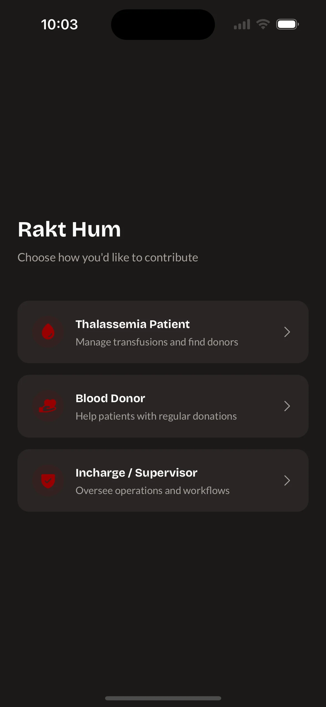 | 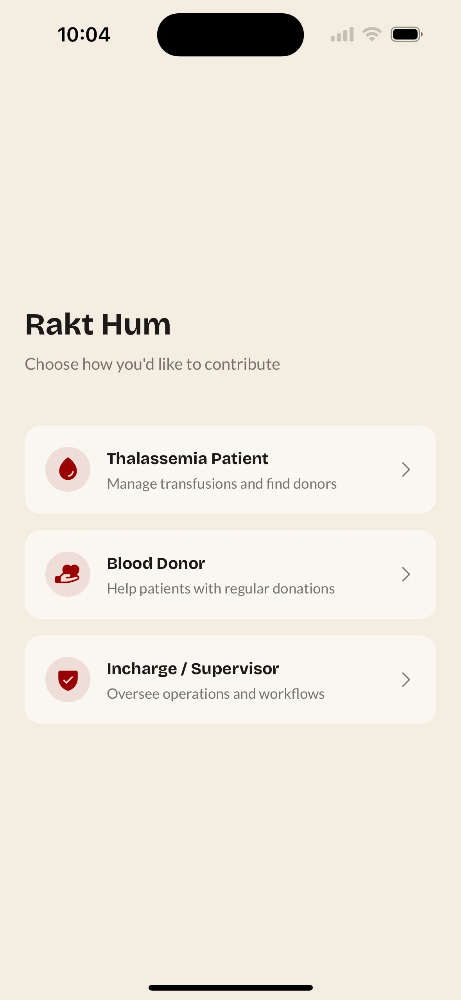 |

### Patient Flow

Thalassemia patient experience — dashboard, community feed, and profile.

| Dashboard | Community Feed | Profile |
|:---------:|:--------------:|:-------:|
| 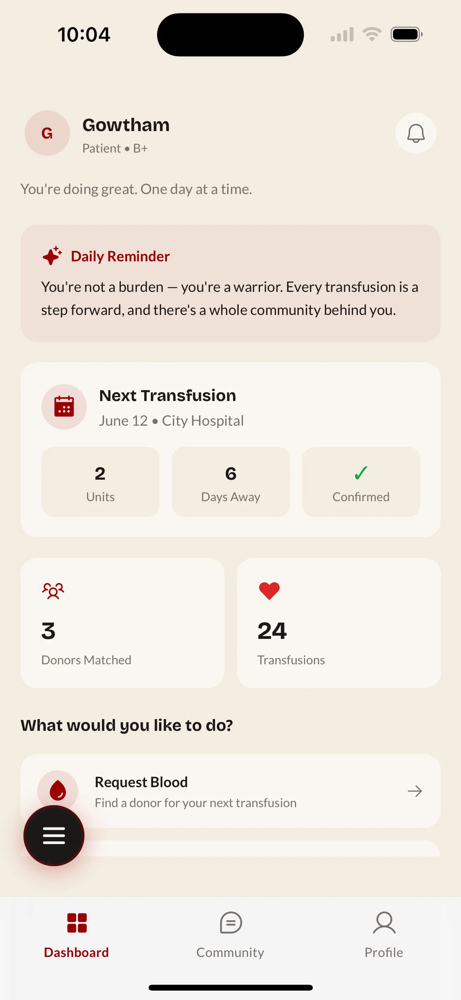 | 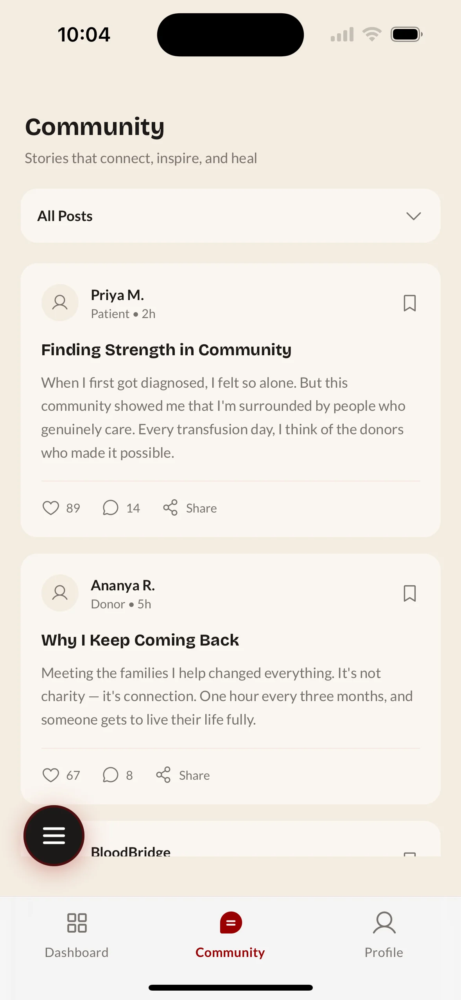 | 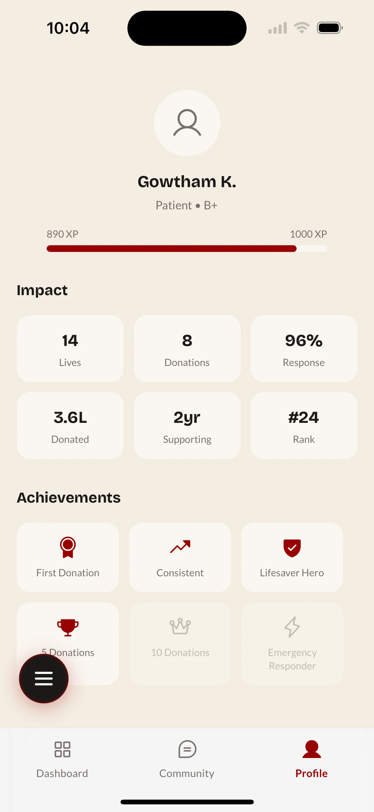 |

### Donor Flow

Blood donor experience — impact tracking and quick actions.

| Dashboard | Profile (FAB Open) | Profile |
|:---------:|:------------------:|:-------:|
| 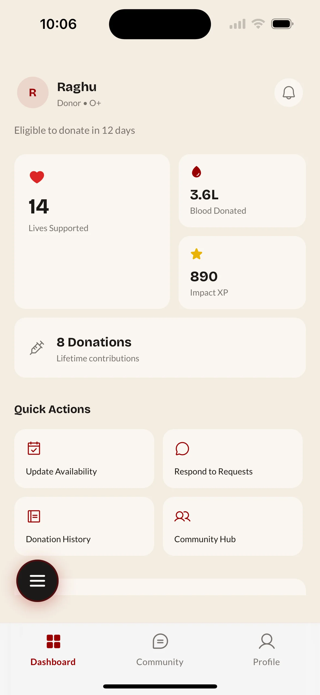 | 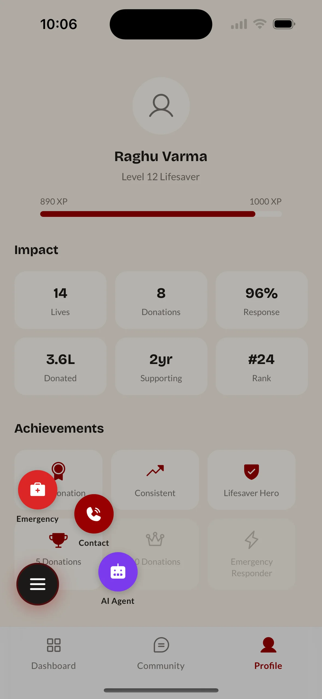 |  |

### Supervisor Flow

Hospital in-charge experience — schedule management and reporting.

| Dashboard | Scrolled View | Weekly Report Alert |
|:---------:|:-------------:|:-------------------:|
| 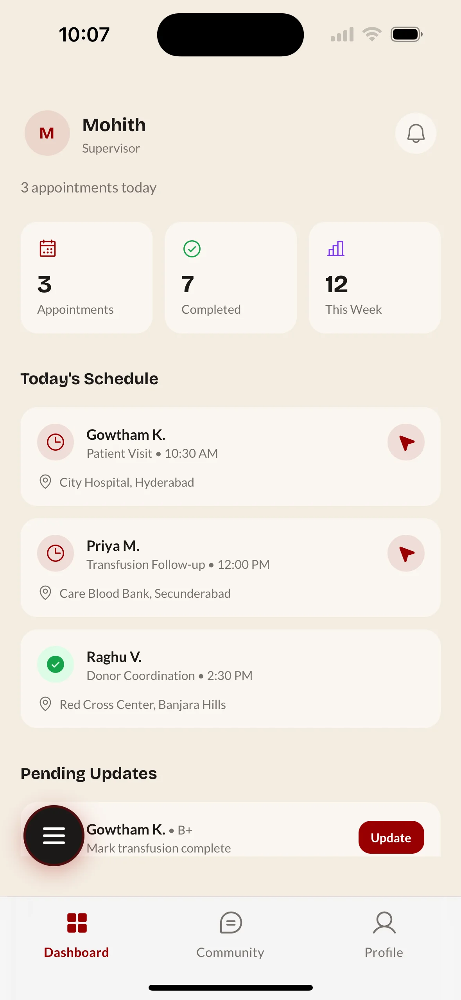 | 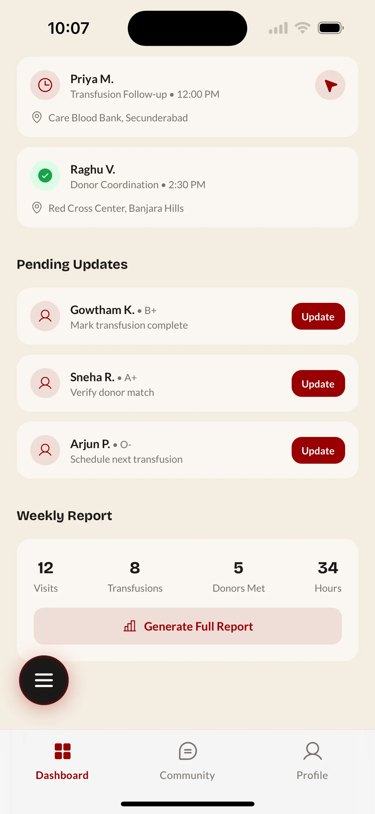 | 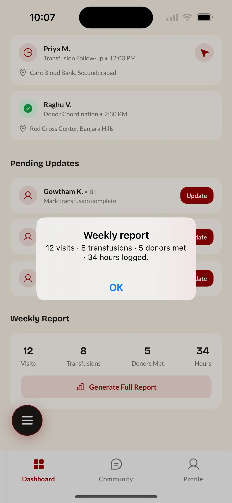 |

### Modals & Action Sheets

Shared components across all user roles.

| Voice Agent | Contact Support | Emergency Request |
|:-----------:|:---------------:|:-----------------:|
| 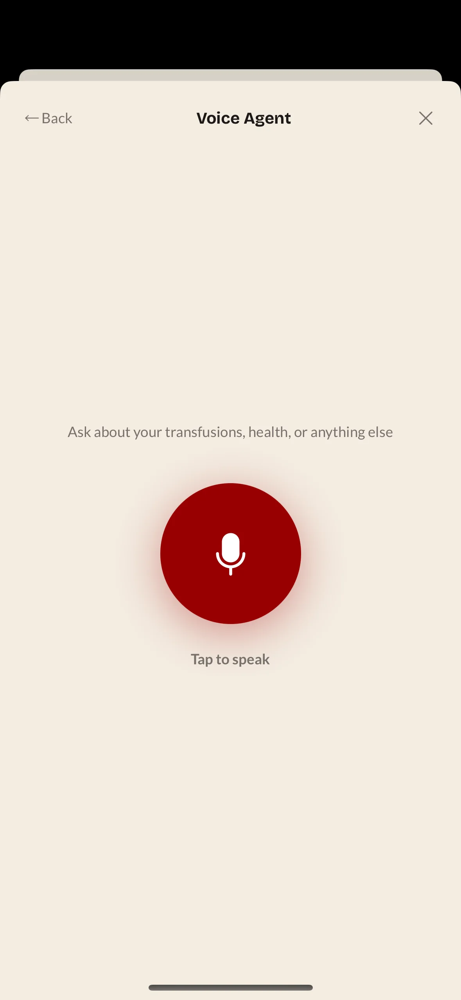 | 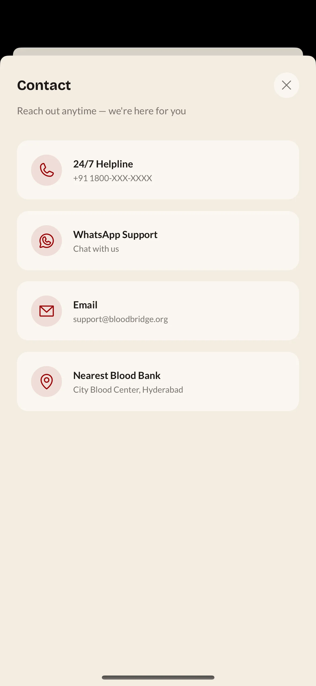 | 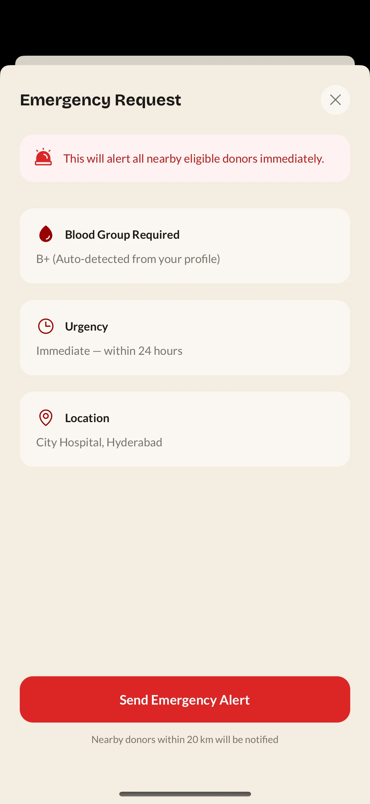 |

| Community Filter | Matched Donors | Nearby Requests |
|:----------------:|:--------------:|:---------------:|
| 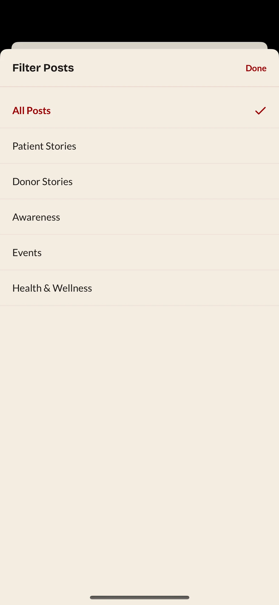 | 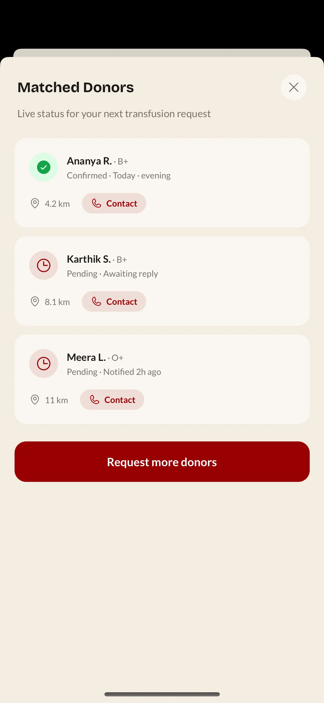 | 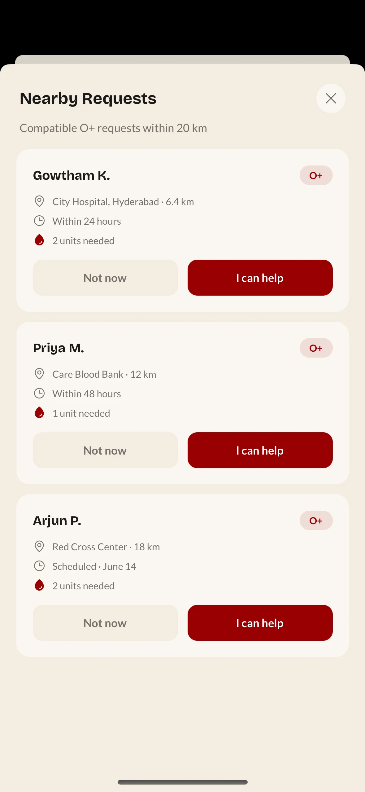 |

| Committed to Help |
|:-----------------:|
| 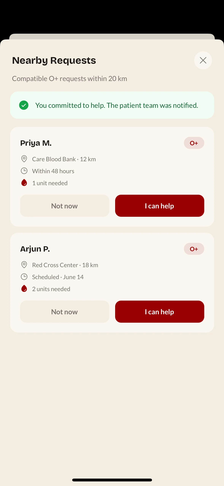 |

---

## Repositories / Codebase

### 1. `afg-admin-dash` — Admin Dashboard

[GitHub](https://github.com/gowtham-2oo5/afg-admin-dash)

A Next.js web dashboard for blood bank administrators and coordinators.

- **Tech:** Next.js 16, React 19, Tailwind CSS, Radix UI, Recharts, Google Maps
- **Features:**
  - Real-time donor matching interface with map-based hospital pinning
  - Donation trend analytics and regional insights
  - Push notification management
  - Community story moderation and blog publishing
  - Awareness campaign tracking

### 2. `ai-service` — FastAPI Core AI Service

[GitHub](https://github.com/gowtham-2oo5/afg-ai-service)
[Live](https://afg-server.gowth.tech)
The backend brain handling voice agents, chat, OCR, and notifications.

- **Tech:** FastAPI, AWS Bedrock (LLM), Sarvam AI (STT/TTS), Twilio, WebSockets
- **Features:**
  - Real-time voice agent via WebSocket (speech-to-text → LLM → text-to-speech)
  - WhatsApp and chat integrations
  - OCR for document processing
  - Push notification dispatch
  - Hospital lookup and session logging
  - Orchestrator managing the full conversation pipeline

### 3. `rakt-matchmaking` — Matchmaking Engine

[GitHub](https://github.com/gowtham-2oo5/afg-algos)

Handles donor ranking algorithms and geospatial matching.

- **Tech:** FastAPI, SQLAlchemy, PostgreSQL + PostGIS, Pandas, AWS Bedrock
- **Features:**
  - Strategy Pattern with two modes:
    - **Emergency:** Prioritizes proximity (distance-weighted scoring) for critical requests
    - **Scheduled:** Prioritizes donor reliability with 14-day cooldown enforcement
  - PostGIS spatial queries with GiST indexing for fast geo-filtering
  - Composite scoring pushed to SQL level for performance
  - Seeded with 10,000+ verified hospitals and blood banks across India

### 4. `rn-client` — Mobile App

[GitHub](https://github.com/gowtham-2oo5/afg-rn-client)

React Native app serving as the primary interface for patients, donors, and hospital in-charges.

- **Tech:** Expo (SDK 54), React Native, NativeWind (Tailwind), Expo Router, Expo Notifications
- **Features:**
  - Role-based experience (patient, donor, in-charge)
  - Dashboard with live request status
  - Community feed for donor stories
  - Profile and donation history
  - Push notifications for urgent requests
  - Campaign participation

## Getting Started

Each project has its own setup. Navigate into the respective folder:

```bash
# Admin Dashboard
cd afg-admin-dash
npm install
npm run dev

# AI Service
cd ai-service
python -m venv .venv && .venv\Scripts\activate
pip install -r requirements.txt
uvicorn app.main:app --reload

# Matchmaking Engine
cd rakt-matchmaking
python -m venv .venv && .venv\Scripts\activate
pip install -r requirements.txt
uvicorn app.main:app --reload --port 8001

# Mobile App
cd rn-client
npm install
npx expo start
```

## Environment Variables

Each service requires its own `.env` file. Check `.env.example` in `ai-service` and `rn-client` for required keys. The admin dashboard needs `NEXT_PUBLIC_GOOGLE_MAPS_API_KEY` for the map feature.
